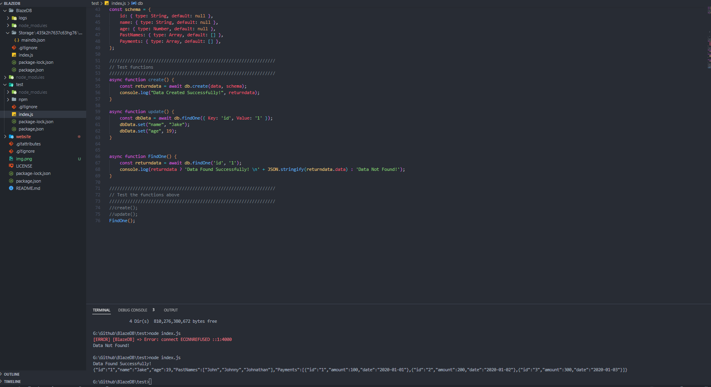

# BlazeDB
BlazeDB is a blazing fast NoSQL database built for modern applications. It provides a lightweight and easy-to-use data storage solution that is designed to scale with your application. With a powerful query language and a flexible data model, BlazeDB is the perfect choice for developers who want to build high-performance applications without sacrificing simplicity. Whether you're building a small hobby project or a large-scale enterprise application, BlazeDB has everything you need to get the job done.

    

    

